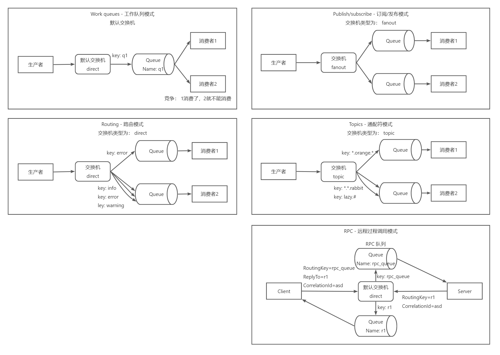

# 一些研究
这个库记录一些技术的研究的 Demo 代码（之所以要建立这个库，一是向保存代码，二是做代码同步，毕竟不同电脑之间云同步代码不好）

# 消息队列

消息队列的研究

这里选型 RabbitMQ

RabbitMQ 基本使用

RabbitMQ 5 种模式

## 消息丢失

1. 生产者到 RabbitMQ 消息丢失
2. RabbitMQ 中存储的消息丢失
3. RabbitMQ 到消费者消息丢失

### 生产者到 RabbitMQ 消息丢失

1. 网络丢包、网络故障
2. 代码层面、配置层面 考虑不足

#### 网络丢包、网络故障

这种情况 RabbitMQ 会给生产者发送 nack 消息，告知生产者消息发布失败

#### 代码层面、配置层面 考虑不足

生成者消息发送到交换机，但交换机没有绑定队列，消息丢失

### RabbitMQ 中存储的消息丢失

1. 未持久化
2. 高可用/热备

#### 未持久化

交换机、队列、消息 都需要持久化

#### 高可用/热备

队列、磁盘 都挂了

### RabbitMQ 到消费者消息丢失

1. 消费者收到消息，未来得及处理，挂了

#### 消费者收到消息，未来得及处理，挂了

消费者刚收到消息，还没处理，但是消费者服务挂掉了
